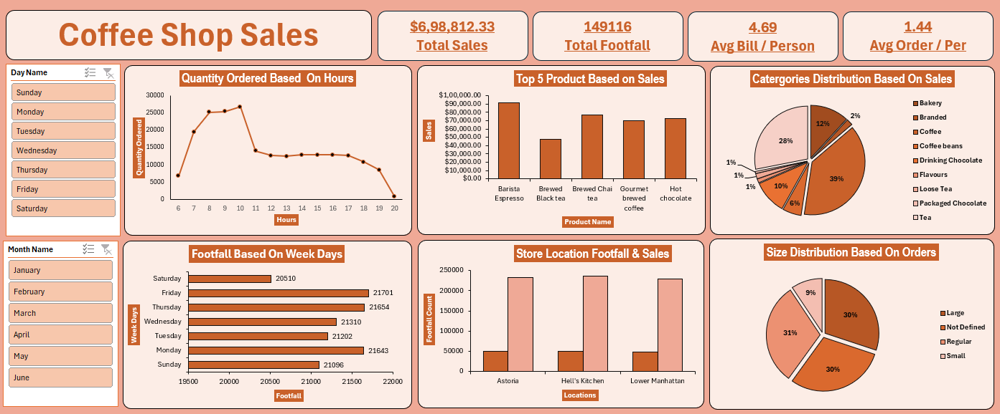

# Coffee Shop Sales Data Analysis

## Project Overview

This is an end-to-end data analysis project completed using Microsoft Excel. The project analyzes coffee shop sales data consisting of approximately 1.5 lakh records.

The main objective of this project was to convert raw transactional data into meaningful business insights through data cleaning, analysis, KPI tracking, and dashboard creation.

## Tools Used

* Microsoft Excel
* Pivot Tables
* Charts
* Dashboard
* Data Cleaning
* Data Analysis
* Business Insights

## Dataset Overview

The dataset contains coffee shop sales transaction records. It was used to analyze customer footfall, sales performance, product demand, order size, store performance, and time-based sales trends.

## Data Preparation

The following data preparation steps were performed:

* Removed duplicate records
* Handled missing values
* Standardized date formats
* Standardized product categories
* Checked pricing formats
* Validated calculations to ensure accurate KPIs
* Prepared the data for pivot table analysis and dashboard creation

## Key Metrics / KPIs

* Total Sales: $698,812.33
* Total Footfall: 149,116 customers
* Average Bill per Person: 4.69
* Average Orders per Customer: 1.44

## Key Insights

* The highest customer demand was observed between 8 AM and 10 AM.
* Thursday and Friday recorded the highest footfall.
* Barista Espresso, Brewed Chai Tea, and Hot Chocolate were the top revenue-driving products.
* Coffee contributed the largest category share at approximately 39%.
* All store locations showed stable and balanced performance.
* Large, Regular, and Small order sizes contributed almost equally.

## Business Recommendations

* Focus marketing campaigns during peak morning hours to increase sales.
* Increase staff availability between 8 AM and 10 AM to manage high customer demand.
* Promote low-performing products using discounts, combo offers, or special deals.
* Use high-performing categories like Coffee for upselling opportunities.
* Improve weekend engagement strategies to increase customer footfall.
* Maintain proper stock of top-performing products to avoid missed sales opportunities.

## Project Workflow

1. Imported the Coffee Shop Sales dataset into Microsoft Excel
2. Cleaned and prepared the raw data
3. Removed duplicates and handled missing values
4. Standardized dates, categories, and pricing formats
5. Created pivot tables for analysis
6. Built charts to visualize business performance
7. Designed an Excel dashboard
8. Identified key insights from the dashboard
9. Prepared business recommendations based on the analysis

## Dashboard Preview

Add your dashboard screenshot here after uploading it to this folder.

Example:

## Files in This Project

* `Coffee_Shop_Sales_Dashboard.xlsx` - Main Excel file containing data analysis and dashboard
* `dashboard_screenshot.png` - Dashboard preview image
* `README.md` - Project documentation

## Conclusion

This project demonstrates how a large dataset can be analyzed effectively using Microsoft Excel. The dashboard helps identify important business patterns such as peak sales hours, top-performing products, customer footfall trends, and category performance.

The insights generated from this project can support better decision-making in staffing, inventory planning, marketing campaigns, and sales improvement strategies.

## Author

**Sufiyan Nathani**

Aspiring Data Analyst skilled in Microsoft Excel, Data Cleaning, Data Analysis, Dashboard Creation, Business Insights, and AI tools.
